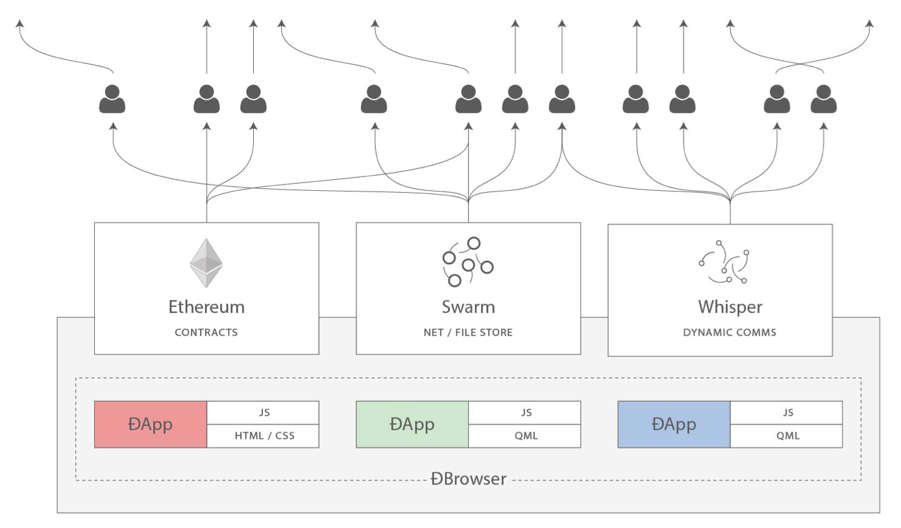

### 什么是以太坊

以太网是“世界计算机”。

以太坊是一个状态机,有两个基本功能

1. 全局可访问的单例状态
2. 将更改应用于该状态的虚拟机

以太坊是一个开源的、全球的、去中心化的计算架构，执行智能合约程序。使用区块链来同步和存储系统状态，使用加密货币ether来计量和约束执行资源的成本。

### 区块链的组件

公链通常包含以下组件:

- 传播交易和包含已验证交易区块的点对点网络
- 状态机中实现的一系列共识机制
- 消息，已交易的形式表示，代表状态转移。
- 根据共识机制处理交易的状态机
- 分布式数据库，记录所有状态转移的日志
- 共识算法，通过强制参与者竞争并使用共识机制约束他们。
- 上述内容的一个或多个开源软件的实现。

### 以太坊开发的四个阶段

前言Frontier => 家园Homestead => 大都会Metropolis => 宁静Serenity

中间的硬分叉代号:

- 冰河时代Ice Age

- DAO
- 蜜桔前哨Tangerine Whistle
- 假龙Spurious Dragon
- 拜占庭Byzantium
- 君士坦丁堡Constaninople

Ice Age:引入指数级难度增长的一个难题，激励了到权益证明机制的过渡。

DAO:恢复被破坏的DAO合约的硬分叉，导致以太坊分裂为以太坊经典和以太坊两个竞争系统。

Tangerine Whistle:改变某些IO秘籍操作的燃气计算方法和清除拒绝服务攻击累计状态的硬分叉。

Spurious Dragon:解决更多拒绝服务攻击向量和另一种状态清楚的硬分叉，包括转播攻击保护机制。

> 以太坊不仅追踪货币所有权的状态，还追踪通用数据存储的状态转换。通常我们指的是任何可以表示为key-value tuple的数据。

### 以太坊的组件

Ethereum中包含的系统组件:

- P2P Network

- Consensus rules

  以太坊的共识规则

- Transactions

  以太坊交易，包括发送者，接受者，值和数据负载等。

- State Machine

  状态机。以太坊的状态转移由Ethereum虚拟机(EVM)处理，这是一个执行bytecode(机器语言指令)的基于栈的虚拟机。智能合约以高级语言(如Solidity)编写，并编译为字节码以便在EVM上执行。

- Blockchain

  以太坊的区块链作为database(Google的LevelDB)存储在每个节点上，该区块链在称为梅克尔帕特里夏树(MPT,Merkle Patricia Tree)的序列化哈希数据结构中 包含交易和系统状态。

- Consensus Algorithm

  共识算法，以太坊目前使用Ethash的工作量证明算法，将来会过渡到称为Casper的权益证明(POS)系统。

- Clients

  以太坊有几个可操作的客户端软件实现，最突出的是Go-Ethereum(Geth)和Parity。

### 参考文献

以太坊黄皮书:<https://ethereum.github.io/yellowpaper/paper.pdf>

以太坊褐皮书(为耿冠发的读者以不太正式的语言重写黄皮书):<https://github.com/chronaeon/beigepaper>

翻译版:http://www.fanyigou.net/doc/waitTranslateActivity.htm

以太坊状态机 —— 一个“Awesome”资源列表 <https://github.com/ethereum/wiki/wiki/Ethereum-Virtual-Machine-(EVM)-Awesome-List>

Merkle Patricia Trees: <https://github.com/ethereum/wiki/wiki/Patricia-Tree>

Ethash 工作量证明共识算法： <https://github.com/ethereum/wiki/wiki/Ethash>

Casper 权益证明 v1 实现指南: <https://github.com/ethereum/research/wiki/Casper-Version-1-Implementation-Guide>

### 从通用区块链到去中心化应用(ÐApps)

以太坊作为一种可用于各种用途的通用区块链，但很快以太坊的愿景扩展为开发去中心化应用(DApps)的平台。DApps代表比智能合约更广阔的视角。

DApp是基于开放的|去中心化的|点对点基础架构服务的Web应用程序。

DApp至少包含以下部分:

- 区块链上的智能合约
- 一个Web前端用户界面

此外，许多DApp还包括其他去中心化组件，例如:

- 去中心化P2P存储协议和平台
- 去中心化P2P消息传递协议和平台

web3.js将js应用程序与以太坊区块链连接起来，web3.js库还包含换一个名为Swarm的P2P存储网络接口和一个名为Whsper的P2P消息传递服务。

### 以太坊的开发文化

- 在比特币中，开发以保守原则为指导：所有变化都经过仔细研究，以确保现有系统都不会中断。大部分情况下，只有在向后兼容时才会执行更改。允许现有客户“选择加入”，但如果他们决定不升级，将继续运作。

- 在以太坊中，开发文化的重点是速度和创新。这个咒语是“快速行动，解决事情”。如果需要进行更改，即使这意味着使之前的假设失效，破坏兼容性或强制客户端进行更新，也会执行更改。以太坊的开发文化的特点是快速创新，快速进化和愿意参与实验。

对开发者来说，意味着你必须保持灵活性和持续学习，随着一些潜在的假设变化，随时准备重建你的基础设施。以太坊开发人员面临的一个重大挑战是将代码部署到不可变账本与仍然在快速发展的开发平台之间的内在矛盾。

你不能简单地“**升级**”你的智能合约，你必须准备部署新的智能合约、迁移用户、应用程序和资金，并重新开始😀

最终以太坊核心协议的开发速度将会放慢，其接口将会变得固定。但与此同时创新是推动原则，你最好跟上脚步，没人会为你放慢速度!

### 为什么学习以太坊?

区块链具有非常陡峭的学习曲线，因为他们将多个学科融合到了一个领域：编程，信息安全，密码学，经济学，分布式系统，对等网络，智能合约等。

以太坊使这一学习曲线变得平缓，你马上就可以开始！

但是当你学习并开始更深入的观察时，总会有另一层复杂性和奇迹！🔮

以太坊是学习区块链的绝佳平台，它构建了一个庞大的开发者社区。

以太坊是为开发者开发的***开发者的区块链***。